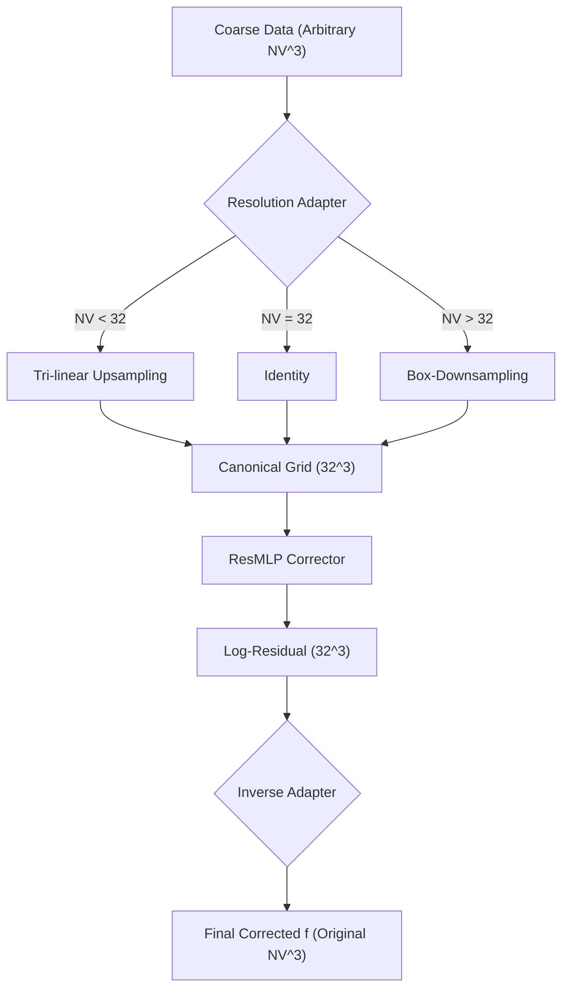
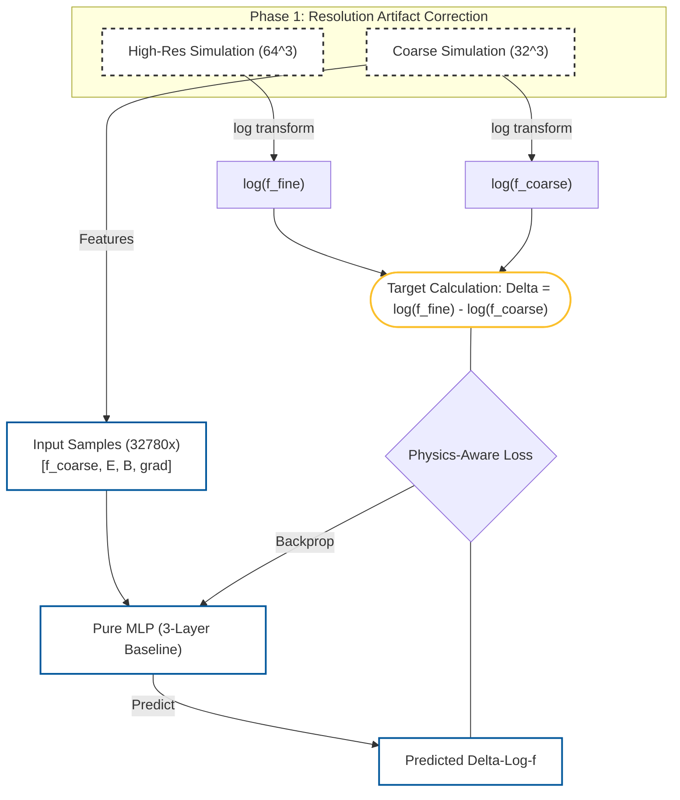
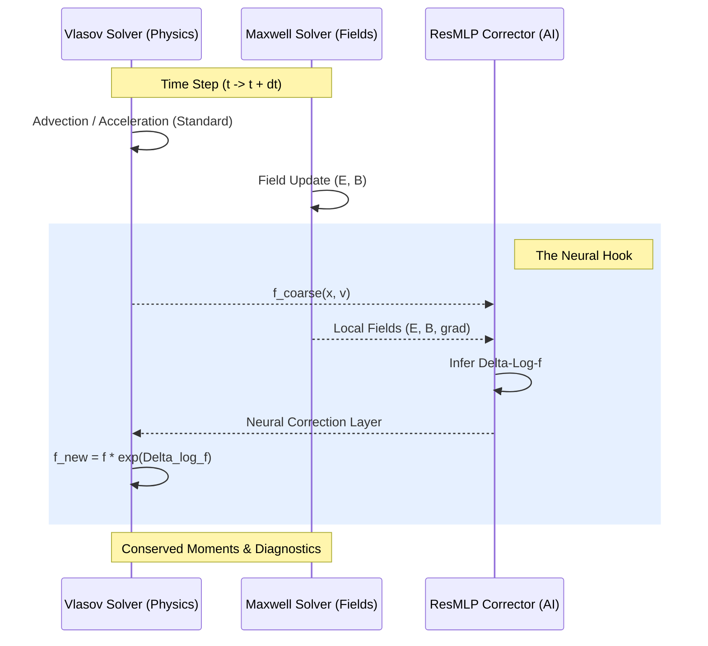

# Technical Schematic: Resolution Artifact Correction

This document details the methodology for the **VLSV-JAX Neural Corrector**, specifically focusing on how the framework bridges the gap between heterogeneous coarse resolutions and high-fidelity fine-resolution targets.

## 1. The Core Philosophy
Directly correcting a distribution function $f$ is difficult because of its massive dynamic range ($10^{-5}$ to $0.5$). Instead, our model learns a **Log-Residual Mapping**:
$$f_{fine}(x, v) = f_{coarse}(x, v) \cdot \exp(\text{MLP}(x, v))$$
Or in log-space:
$$\log f_{fine} = \log f_{coarse} + \Delta \log f$$

## 2. The Resolution Adapter (Multi-Grid Logic)
To ensure the MLP can handle any velocity grid (16^3, 32^3, etc.), we introduce a **Canonical Resolution Adapter**.

### The Mapping Workflow:

## 3. Architecture & Training Flow (Detailed Schema)

The diagram below visualizes how the **Fine Resolution Simulation** acts as the high-fidelity oracle to define the target for the MLP.

### Key Differences in this Architecture:
1.  **Direct vs Residual**: The MLP doesn't predict the distribution; it predicts the **Residual** between the coarse and fine regimes.
2.  **The Fine-Res Anchor**: The "Ground Truth" for every training sample comes from a high-fidelity $64^3$ simulation that has been box-downsampled to the coarse grid.
3.  **Logarithmic Stability**: By calculating `Delta = log(f_fine) - log(f_coarse)`, we allow the model to learn corrections for both the dense thermal core (high values) and the kinetic beams (very low values) simultaneously.

## 4. Solver-in-the-loop: The Hybrid Integration

This schematic shows how the Neural Corrector is injected into the **Hybrid Vlasov-Maxwell** solver loop.

