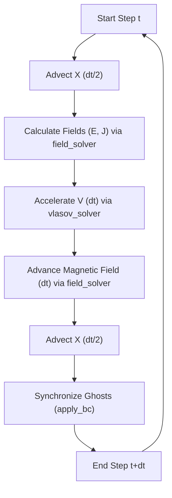

# VLSV-JAX: Differentiable 1D-3V Hybrid Vlasov Plasma Solver

[](https://github.com/google/jax)
[](https://opensource.org/licenses/MIT)

**VLSV-JAX** is a high-performance, fully differentiable modular framework for plasma kinetic simulations. Built on top of **JAX**, it enables deeply fused, multi-step integrations optimized for GPU/TPU accelerators.

> [!TIP]
> This solver is designed specifically for **Physics-Informed Machine Learning (Physics-ML)** workflows, providing exact gradients through the entire simulation timeline for discovery and optimization.

---

## 🚀 Key Features

*   **Multi-Regime Physics**: Specialized modules for **Hybrid** (Ion kinetics) and **Electrostatic** (Electron kinetics).
*   **Neural Correction Engine**: Built-in specialized MLP hooks for learning the numerical residuals between coarse and fine resolution simulations.
*   **Modern Architecture**: Uses JAX-native **Pytree** state management for end-to-end differentiability.
*   **Numerical Precision**:
    *   **SLICE-3D**: Semi-Lagrangian scheme for conservative velocity rotations.
    *   **Ghost-Cell Boundaries**: 2nd-order Central differences enforced through synchronized 2-cell padding.
*   **Offline Physics-ML Pipeline**: Integrated dataset handling for enriched features ($f, E, B$ fields + spatial gradients).
*   **Differentiable by Design**: Fully compatible with `jax.grad`, `jax.vmap`, and `jax.jit`.

---

## 🏗️ Project Architecture

The codebase is modularized to decouple physics logic from numerical infrastructure:

### 1. Hybrid Vlasov-Maxwell Solver
*   [`simulator.py`](file:///Users/ivanzait/Documents/Documents_LM4500/Codes/VLSV-JAX-2/Vlasov-Jax/simulator.py): Main entry point for simulations.
*   [`init_simulation.py`](file:///Users/ivanzait/Documents/Documents_LM4500/Codes/VLSV-JAX-2/Vlasov-Jax/init_simulation.py): Centralized setup for physical parameters and grid verification.
*   [`vlasov_solver.py`](file:///Users/ivanzait/Documents/Documents_LM4500/Codes/VLSV-JAX-2/Vlasov-Jax/vlasov_solver.py): Implementation of the high-level Strang-split orchestrator.
*   [`field_solver.py`](file:///Users/ivanzait/Documents/Documents_LM4500/Codes/VLSV-JAX-2/Vlasov-Jax/field_solver.py): Functional Maxwell/Faraday/Moment kernels.
*   [`boundary.py`](file:///Users/ivanzait/Documents/Documents_LM4500/Codes/VLSV-JAX-2/Vlasov-Jax/boundary.py): Ghost cell synchronization and BC enforcement.
*   [`state.py`](file:///Users/ivanzait/Documents/Documents_LM4500/Codes/VLSV-JAX-2/Vlasov-Jax/state.py): Core JAX Pytree data structure (`SimulationState`).
*   [`init_shock.py`](file:///Users/ivanzait/Documents/Documents_LM4500/Codes/VLSV-JAX-2/Vlasov-Jax/init_shock.py): Initial Condition generator for shock physics.

### 2. Neural Correction (ML)
*   [`ml_dataset.py`](file:///Users/ivanzait/Documents/Documents_LM4500/Codes/VLSV-JAX-2/Vlasov-Jax/ml_dataset.py): High-fidelity downsampling ($64^3 \rightarrow 32^3$) and enriched multi-field feature engineering.
*   [`ml_models.py`](file:///Users/ivanzait/Documents/Documents_LM4500/Codes/VLSV-JAX-2/Vlasov-Jax/ml_models.py): Deep 3-layer MLP architecture with **Physics-Weighted Loss** (Moment consistency).
*   [`train_offline.py`](file:///Users/ivanzait/Documents/Documents_LM4500/Codes/VLSV-JAX-2/Vlasov-Jax/train_offline.py): Supervised learning engine for training log-space residuals ($\Delta \log f$).

---

## 🔄 Simulation Cycle (Darwin Hybrid)

VLSV-JAX uses a **Strang-Splitting** sequence to maintain 2nd-order accuracy in time:



---

## 📊 Data Format & Persistence

Simulation data is stored in **`.npz`** format for broad compatibility. Each file contains:
*   **`f`**: 4D Distribution Function $[NX_{total}, NV, NV, NV]$.
*   **`B_x, B_y, B_z`**: 1D Magnetic field components.
*   **`E_x, E_y, E_z`**: 1D Electric field components.
*   **`x, v`**: Physical grid coordinates.

> [!NOTE]
> Saved data strictly contains only the **physical domain** (ghost cells are automatically sliced out during persistence).

---

## 📖 Quick Start

### Running a Hybrid Shock Simulation
```bash
python3 simulator.py --config config_coarse
```

### Performing Offline Training (Neural Correction)
```bash
# Generate Fine/Coarse data, then train the MLP
python3 train_offline.py
```
*Trained weights are persistent in `ml_weights/`.*

---

## 📈 ML Correction Benchmarks

The current **Deep High-Capacity Model** achieved the following improvements on unseen shock test data:
*   **Log-Distribution Fidelity**: **61.3%** error reduction.
*   **Bulk Velocity ($V_x$)**: **61.4%** error reduction.
*   **Physical Consistency**: Maintained density conservation within 3.1% of baseline.

---

## 🌍 Roadmap
See [taskboard.md](file:///Users/ivanzait/Documents/Documents_LM4500/Codes/VLSV-JAX-2/Vlasov-Jax/taskboard.md) for current milestones and ML integration progress.
