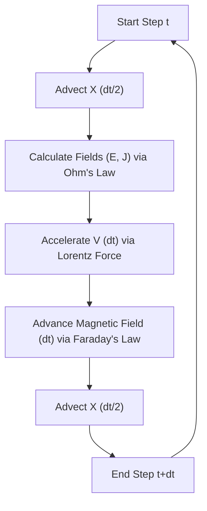

# VLSV-JAX: Differentiable 1D-3V Hybrid Vlasov Plasma Solver

[](https://github.com/google/jax)
[](https://opensource.org/licenses/MIT)

**VLSV-JAX** is a high-performance, fully differentiable modular framework for plasma kinetic simulations. Built on top of **JAX**, it enables deeply fused, multi-step integrations optimized for GPU/TPU accelerators.

> [!TIP]
> This solver is designed specifically for **Physics-Informed Machine Learning (Physics-ML)** workflows, providing exact gradients through the entire simulation timeline for discovery and optimization.

---

## 🚀 Key Features

*   **Multi-Regime Physics**: Specialized modules for **Hybrid** (Ion kinetics) and **Electrostatic** (Electron kinetics).
*   **Numerical Precision**:
    *   **SLICE-3D**: Semi-Lagrangian scheme for conservative velocity rotations.
    *   **TVD Advection**: 2nd-order Flux-Limited schemes for sharp shock capturing.
*   **Darwin Approximation**: Uses the Darwin Hybrid model to efficiently simulate low-frequency electromagnetic phenomena (Alfvénic scales) by neglecting the displacement current.
*   **Differentiable by Design**: Fully compatible with `jax.grad`, `jax.vmap`, and `jax.jit`.

---

## 🏗️ Project Architecture

The codebase is modularized to decouple physics logic from numerical infrastructure:

### 1. Hybrid Vlasov-Maxwell Solver
Focused on ion-scale electromagnetic problems like shocks and instabilities.
*   [`run_maxwell.py`](file:///Users/ivanzait/Documents/Documents_LM4500/Codes/VLSV-JAX/run_maxwell.py): Main entry point for simulations.
*   [`initialize_maxwell.py`](file:///Users/ivanzait/Documents/Documents_LM4500/Codes/VLSV-JAX/initialize_maxwell.py): Centralized setup for physical parameters and grid verification.
*   [`solver_maxwell.py`](file:///Users/ivanzait/Documents/Documents_LM4500/Codes/VLSV-JAX/solver_maxwell.py): Implementation of the Darwin solver and Ohm's law.
*   [`setup_shock.py`](file:///Users/ivanzait/Documents/Documents_LM4500/Codes/VLSV-JAX/setup_shock.py): Initial Condition generator using Rankine-Hugoniot relations.

### 2. Electrostatic Vlasov-Poisson Solver
Located in [`vlasov-poisson/`](file:///Users/ivanzait/Documents/Documents_LM4500/Codes/VLSV-JAX/vlasov-poisson/), optimized for high-frequency electron dynamics.

### 3. Analytics & Diagnostics
*   `plasma_calculator.ipynb`: Jupyter notebook for deriving normalized physical parameters.
*   `plot_shock.py`: High-fidelity visualization toolkit.

---

## 🔄 Simulation Cycle (Darwin Hybrid)

VLSV-JAX uses a **Strang-Splitting** sequence to maintain 2nd-order accuracy in time while decoupling spatial advection, field updates, and velocity acceleration.



---

## ⚠️ Numerical Stability & Grid Resolution

Recent benchmarks have shown that the solver's initial equilibrium is highly sensitive to the velocity grid spacing ($dv$).

> [!IMPORTANT]
> **Velocity Resolution ($dv$) vs. Spatial Resolution ($dx$)**
> *   **$dx$ Sensitivity**: Variations of $dx$ by a factor of 2 result in minimal (~0.01%) changes in initial pressure balance.
> *   **$dv$ Sensitivity**: The accuracy of moment integration ($n, T$) depends exponentially on $dv$ relative to the thermal velocity ($v_{th}$). Increasing $dv$ can lead to **order-of-magnitude growth** in pressure variation.

**Best Practice**: Ensure $dv < 0.5 \cdot v_{th}$ in all regions of the simulation. The `initialize_simulation` function now includes an automated check and warning for this condition.

---

## 📏 Normalization Scales

| Parameter | Hybrid Solver (Alfvenic) | Electrostatic Solver (Debye) |
| :--- | :--- | :--- |
| **Length** | Ion Skin Depth $d_i = c / \omega_{pi}$ | Debye Length $\lambda_D$ |
| **Time** | Inv. Ion Cyclotron $\Omega_{ci}^{-1}$ | Inv. Plasma Freq. $\omega_{pe}^{-1}$ |
| **Velocity** | Alfvén Velocity $v_A$ | Electron Thermal Velocity $v_{te}$ |
| **B-Field** | Background Field $B_0$ | Externally scaled |

---

## 📖 Quick Start

### Running a Hybrid Shock Simulation
```bash
python run_maxwell.py
```
*Outputs (plots, diagnostics) are saved to `plots_maxwell/`.*

### Running an Electrostatic Two-Stream Simulation
```bash
cd vlasov-poisson
python run_poisson.py
```
