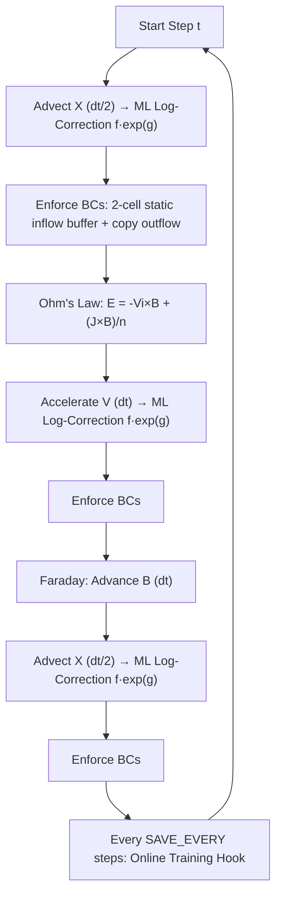

# VLSV-JAX: Differentiable 1D-3V Hybrid Vlasov Plasma Solver

[](https://github.com/google/jax)
[](https://opensource.org/licenses/MIT)

**VLSV-JAX** is a high-performance, fully differentiable modular framework for plasma kinetic simulations. Built on top of **JAX**, it enables deeply fused, multi-step integrations optimized for GPU/TPU accelerators.

> [!TIP]
> This solver is designed specifically for **Physics-Informed Machine Learning (Physics-ML)** workflows, providing exact gradients through the entire simulation timeline for discovery and optimization.

---

## 🚀 Key Features

*   **Multi-Regime Physics**: Specialized modules for **Hybrid** (Ion kinetics) and **Electrostatic** (Electron kinetics).
*   **Numerical Precision**:
    *   **SLICE-3D (Hybrid)**: Semi-Lagrangian scheme using dimensional splitting and linear interpolation for conservative velocity rotations.
    *   **TVD Advection (Electrostatic)**: 2nd-order Flux-Limited schemes (Minmod) for high-frequency sharp wave capturing.
*   **Shock Simulation Support**: Native support for **Rankine-Hugoniot** initial conditions with physically correct asymmetric boundaries (static inflow / copy outflow) and a **2-cell inflow buffer** to suppress artificial density notches.
*   **Darwin Approximation**: Uses the Darwin Hybrid model with a massless electron fluid to efficiently simulate low-frequency electromagnetic phenomena (Alfvénic scales).
*   **Online Physics-ML**: Built-in solver-in-the-loop training — ML weights update **during** the simulation, matching coarse snapshots to fine ground-truth in real time.
*   **Differentiable by Design**: Fully compatible with `jax.grad`, `jax.vmap`, and `jax.jit` for exact gradient-based optimization.

---

## 🏗️ Project Architecture

The codebase is modularized to decouple physics logic from numerical infrastructure:

### 1. Hybrid Vlasov-Maxwell Solver
Focused on ion-scale electromagnetic problems like shocks and instabilities.
*   [`run_maxwell.py`](file:///Users/ivanzait/Documents/Documents_LM4500/Codes/VLSV-JAX/run_maxwell.py): Main entry point — simulation loop, orchestrator, and I/O management.
*   [`initialize_maxwell.py`](file:///Users/ivanzait/Documents/Documents_LM4500/Codes/VLSV-JAX/initialize_maxwell.py): Refined setup logic split into testable sub-functions: `build_grid_params()`, `verify_initial_state()`, and the `initialize_simulation()` orchestrator.
*   [`solver_maxwell.py`](file:///Users/ivanzait/Documents/Documents_LM4500/Codes/VLSV-JAX/solver_maxwell.py): Core physics logic — Darwin solver, Ohm's law, SLICE-3D advection, Faraday's law, and BC enforcement.
*   [`setup_shock.py`](file:///Users/ivanzait/Documents/Documents_LM4500/Codes/VLSV-JAX/setup_shock.py): Rankine-Hugoniot initial condition generator.

### 2. Configuration System
VLSV-JAX uses a **dual-config** approach:

*   [`config.py`](file:///Users/ivanzait/Documents/Documents_LM4500/Codes/VLSV-JAX/config.py): **Active coarse-grid config** (`NV=32, DV=1.8`) — the simulation being corrected by ML.
*   [`config_baseline.py`](file:///Users/ivanzait/Documents/Documents_LM4500/Codes/VLSV-JAX/config_baseline.py): **Fine-grid config** (`NV=64, DV=0.9`) — used to generate ground-truth snapshots in `data/fine_data/`.

> [!IMPORTANT]
> All simulation toggles (`USE_ML`, `ML_MODE`, `NX`, `NV`, `BC_X`, etc.) live in `config.py`. You do **not** need to edit `run_maxwell.py` directly.

### 3. Electrostatic Vlasov-Poisson Solver
Located in [`vlasov-poisson/`](file:///Users/ivanzait/Documents/Documents_LM4500/Codes/VLSV-JAX/vlasov-poisson/), optimized for high-frequency electron dynamics.

### 4. Physics-ML Infrastructure
*   [`nn_models.py`](file:///Users/ivanzait/Documents/Documents_LM4500/Codes/VLSV-JAX/nn_models.py): Pure JAX log-space CNN (Spatial) and MLP (Velocity) correction layers. Uses `ML_LOG_CLAMP` for stability.
*   [`train_corrector.py`](file:///Users/ivanzait/Documents/Documents_LM4500/Codes/VLSV-JAX/train_corrector.py): **Utility library only** — contains the `maybe_train_step()` hook, Adam optimizer, loss function, and data coarsening utilities.
*   [`data_io.py`](file:///Users/ivanzait/Documents/Documents_LM4500/Codes/VLSV-JAX/data_io.py): Snapshot serialization and ML weight persistence (`.npz`).

### 5. Analytics & Diagnostics
*   [`plasma_calculator.ipynb`](file:///Users/ivanzait/Documents/Documents_LM4500/Codes/VLSV-JAX/plasma_calculator.ipynb): Jupyter notebook for deriving normalized physical parameters.
*   [`plot_shock.py`](file:///Users/ivanzait/Documents/Documents_LM4500/Codes/VLSV-JAX/plot_shock.py): High-fidelity visualization for shock profiles and phase space (→ `plots_maxwell/`, `plots_fine/`).
*   [`verify_training.py`](file:///Users/ivanzait/Documents/Documents_LM4500/Codes/VLSV-JAX/verify_training.py): **3-column verification dashboard** — Fine vs. Coarse vs. Coarse+ML (→ `plots_verification/`).
*   [`verify_io.py`](file:///Users/ivanzait/Documents/Documents_LM4500/Codes/VLSV-JAX/verify_io.py): Dataset consistency and ML weight integrity checker.

---

## 🔄 Simulation Cycle (Darwin Hybrid)

VLSV-JAX uses **Strang-Splitting** to maintain 2nd-order accuracy while decoupling advection, field updates, and acceleration.



---

## ⚡ Darwin Hybrid Model & Ohm's Law

VLSV-JAX implements the Darwin Approximation, eliminating the displacement current. Electrons are treated as a massless fluid:

$$ \mathbf{E} = -\mathbf{V}_i \times \mathbf{B} + \frac{(\nabla \times \mathbf{B}) \times \mathbf{B}}{\mu_0 n_e} - \frac{\nabla p_e}{e n_e} $$

*(Convective and Hall terms active; electron pressure $\nabla p_e$ currently assumed uniform.)*

---

## 🧠 Physics-ML Integration

### Architecture: Log-Space Multiplicative Residuals

All ML corrections use:

$$f_{\text{new}} = f \cdot e^{g}$$

where $g$ is a small log-residual predicted by the network (clamped via `tanh` to ±`5e-2`). This guarantees positivity by construction and handles the 10-order dynamic range of $f$ in shock tails.

### 1. Spatial Correction (Depth-wise 1D CNN)
Applied at each **Advection** sub-step. Operates on `log(f)` across the spatial axis.

### 2. Velocity Space Correction (Field-Aware MLP)
Applied at the **Acceleration** step. Uses local $(E_x, E_y, E_z, B_x, B_y, B_z, n)$ as inputs.

### 3. Online Training (Solver-in-the-Loop)

ML weights evolve **during** the coarse simulation run. Every `SAVE_EVERY` steps, if a matching fine-resolution snapshot exists in `data/fine_data/`, the training hook:
1. Loads and coarsens the fine snapshot (NV: 64→32, integer factor 2)
2. Computes log-MSE loss between the ML-corrected coarse state and the coarsened fine state
3. Executes one Adam step (native JAX, no external libraries)
4. Saves updated weights to `data/ml_data/` at simulation end

| Regime | `USE_ML` | `ML_MODE` | Behaviour |
| :--- | :--- | :--- | :--- |
| **Baseline** | `False` | — | Pure physics. No ML layers active. |
| **Inference** | `True` | `'inference'` | Loads pre-trained weights; applies corrections only. |
| **Online Training** | `True` | `'training'` | Corrections applied + Adam weight updates in-loop. |

> [!WARNING]
> For Online Training, fine-resolution snapshots must be pre-generated in `data/fine_data/` using `config_baseline.py` (NV=64). Without them, the training hook silently skips updates.

---

## ⚠️ Numerical Stability & Grid Resolution

> [!IMPORTANT]
> **Velocity Resolution ($dv$) vs. Spatial Resolution ($dx$)**
> *   **$dx$ Sensitivity**: Variations by a factor of 2 → minimal (~0.01%) impact on pressure balance.
> *   **$dv$ Sensitivity**: Moment integration accuracy depends exponentially on $dv/v_{th}$. Coarse velocity grids cause **numerical heating** — energy grows unphysically.

**Best Practice**: Ensure $dv < 0.5 \cdot v_{th}$. The `initialize_simulation` function includes an automated check.

**2-Cell Inflow Buffer**: The static upstream BC clamps cells `f[0]` and `f[1]` to the initial inflow state. This prevents the artificial density notch that forms when only `f[0]` is frozen while `f[1]` is accelerated by the evolving Lorentz force.

---

## 📏 Normalization Scales

| Parameter | Hybrid Solver (Alfvenic) | Electrostatic Solver (Debye) |
| :--- | :--- | :--- |
| **Length** | Ion Skin Depth $d_i = c / \omega_{pi}$ | Debye Length $\lambda_D$ |
| **Time** | Inv. Ion Cyclotron $\Omega_{ci}^{-1}$ | Inv. Plasma Freq. $\omega_{pe}^{-1}$ |
| **Velocity** | Alfvén Velocity $v_A$ | Electron Thermal Velocity $v_{te}$ |
| **B-Field** | Background Field $B_0$ | Externally scaled |

---

## 🏛️ Project Standards & Engineering

VLSV-JAX adheres to strict engineering principles defined in [`senior_coder.md`](file:///Users/ivanzait/Documents/Documents_LM4500/Codes/VLSV-JAX/senior_coder.md):

*   **No Magic Numbers**: All physical constants and ML hyperparameters (like `ML_LOG_CLAMP`) are centralized in `config.py`.
*   **Dependency Injection**: Grids, solvers, and ML parameters are passed explicitly. Functions exceed 50 lines are refactored into testable sub-components.
*   **Functional Purity**: All core solver routines in `solver_maxwell.py` are pure transformations (`State -> NewState`), maximizing JAX's jit-compilation efficiency.
*   **Transparency**: No hidden global states. Every physical equation (Faraday, Ampere, Ohm) is visible and documented inline.

---

## 📁 Data Directory Layout

```
data/
├── fine_data/          # Fine-resolution ground truth (config_baseline.py, NV=64)
│   └── snapshot_NNNNN.npz
├── vlsv_data/          # Coarse simulation snapshots (config.py, NV=32)
│   └── snapshot_NNNNN.npz
└── ml_data/            # Trained ML model weights
    └── model_weights_final.npz

plots_fine/             # Fine-resolution diagnostic plots
plots_maxwell/          # Coarse simulation step-by-step plots
plots_verification/     # 3-column Fine / Coarse / ML comparison dashboard
```

---

## 📖 Quick Start

> [!IMPORTANT]
> All configuration lives in **`config.py`** (coarse) and **`config_baseline.py`** (fine). Edit before running.

### 1. Generate Fine Ground-Truth Data

Edit `config_baseline.py` if needed, then run using the baseline config:
```bash
python -c "
import config_baseline as config, sys; sys.modules['config'] = config
from initialize_maxwell import initialize_simulation
# ... (see run_maxwell.py for full loop)
"
```
Or temporarily swap the import in `run_maxwell.py` to `import config_baseline as config`.
Snapshots save to `data/fine_data/`.

### 2. Baseline Coarse Simulation (No ML)

Edit `config.py`:
```python
USE_ML = False
```
```bash
python run_maxwell.py
```
*   Plots → `plots_maxwell/` | Snapshots → `data/vlsv_data/`

### 3. Online Physics-ML Training

Edit `config.py`:
```python
USE_ML = True
ML_MODE = 'training'
```
```bash
python run_maxwell.py
```
The training hook fires every `SAVE_EVERY` steps. Weights saved to `data/ml_data/model_weights_final.npz` at simulation end.

### 4. Inference with Pre-trained Weights

Edit `config.py`:
```python
USE_ML = True
ML_MODE = 'inference'
MODEL_PATH = "data/ml_data/model_weights_final.npz"
```
```bash
python run_maxwell.py
```

### 5. Verify ML Quality (3-Column Dashboard)

```bash
python verify_training.py
```
Output → `plots_verification/triple_comparison_NNNNN.png`
Rows: B-Fields | E-Fields | Density & Velocity | Phase Space $f(x, v_x)$ (log-scaled)
